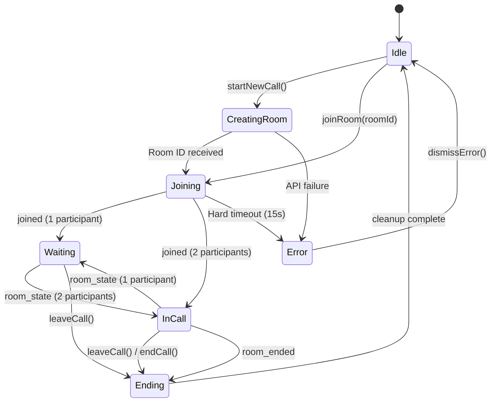
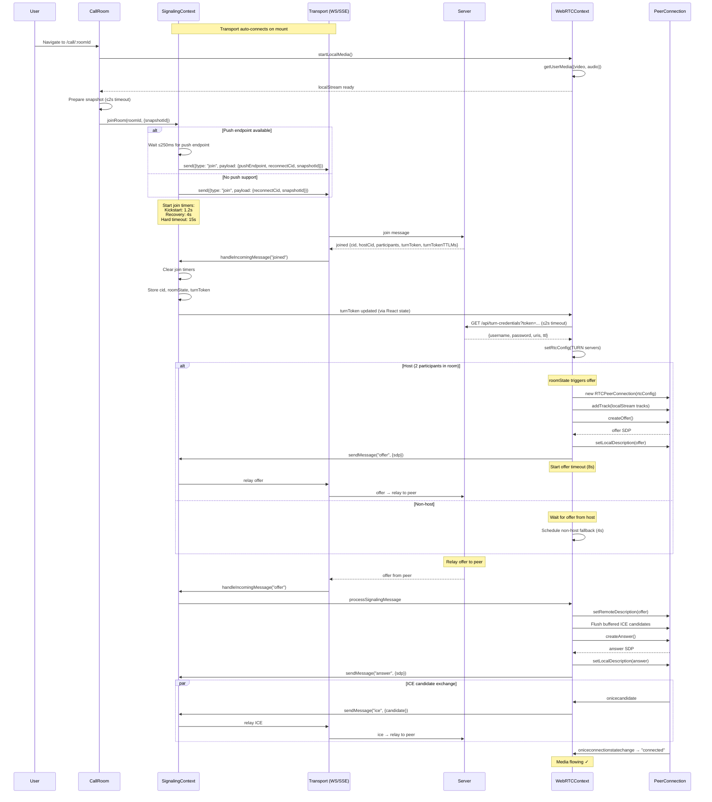
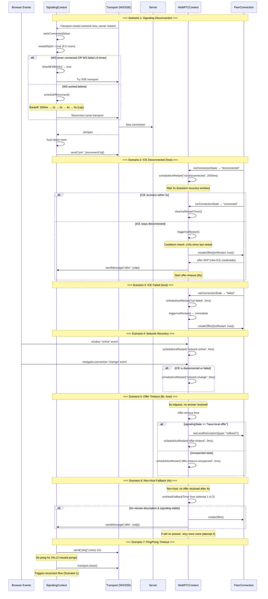
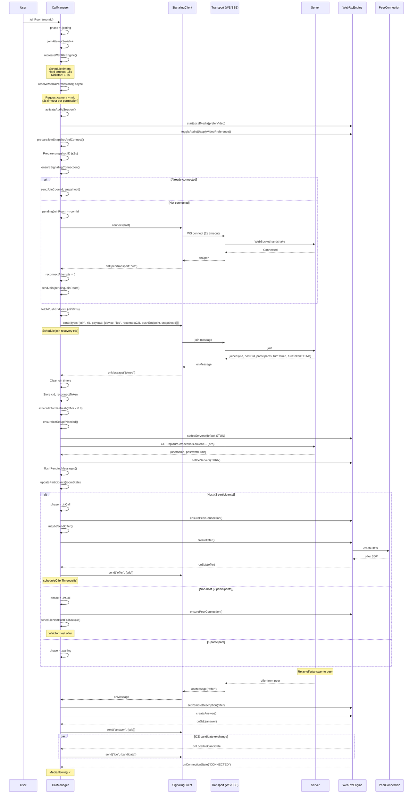
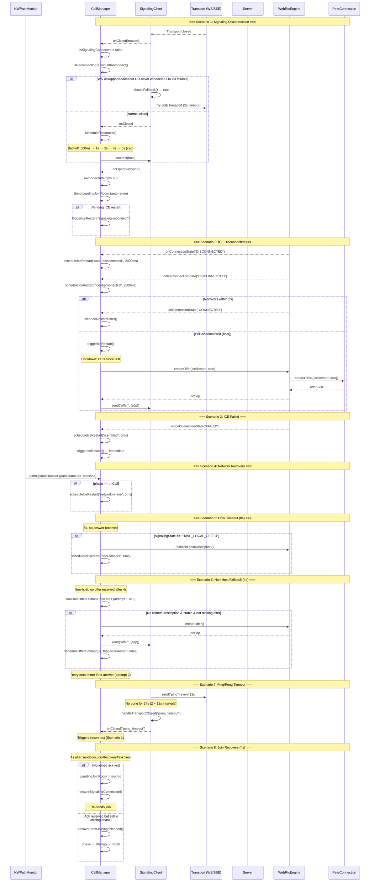
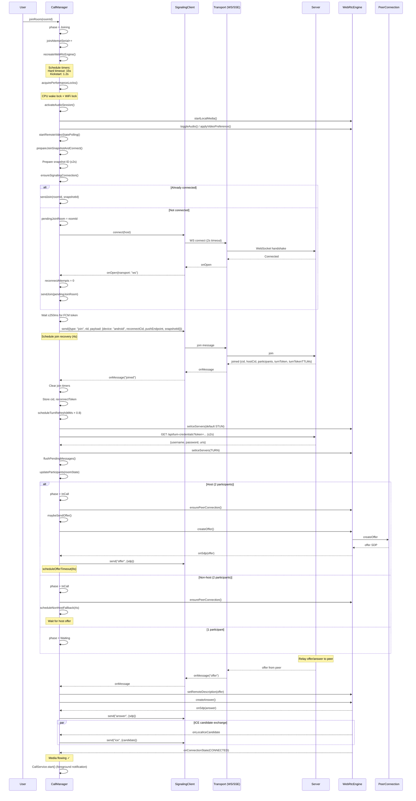
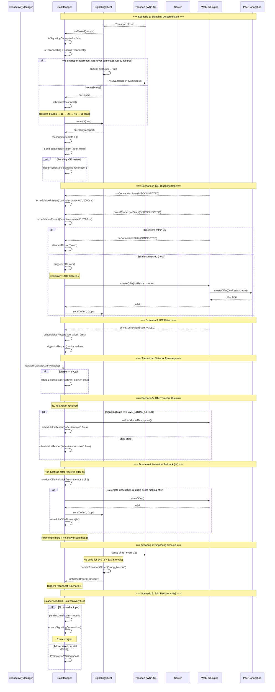
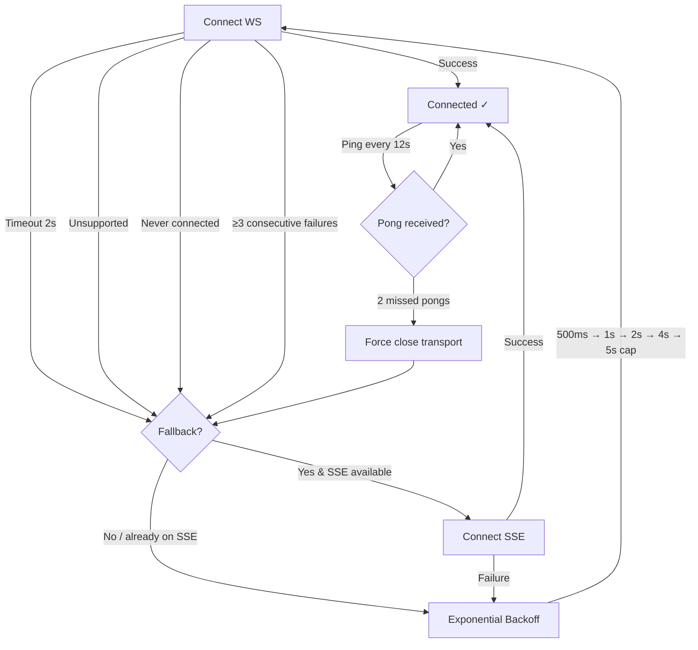

# Call Setup & Recovery Flow Diagrams

Visual reference for the call lifecycle across all three Serenada client platforms.
All platforms share identical resilience constants and nearly identical state machines.

---

## Table of Contents

1. [Shared Resilience Constants](#1-shared-resilience-constants)
2. [Call Phase State Machine](#2-call-phase-state-machine)
3. [Web Client — Call Setup](#3-web-client--call-setup)
4. [Web Client — Call Recovery](#4-web-client--call-recovery)
5. [iOS Client — Call Setup](#5-ios-client--call-setup)
6. [iOS Client — Call Recovery](#6-ios-client--call-recovery)
7. [Android Client — Call Setup](#7-android-client--call-setup)
8. [Android Client — Call Recovery](#8-android-client--call-recovery)
9. [Platform Comparison](#9-platform-comparison)

---

## 1. Shared Resilience Constants

All three platforms define identical values in their `WebRtcResilienceConstants` files.
Cross-platform parity is enforced by `node scripts/check-resilience-constants.mjs`.

| Constant | Value | Category | Purpose |
|---|---|---|---|
| `RECONNECT_BACKOFF_BASE_MS` | 500 ms | Signaling | Exponential backoff base for reconnect |
| `RECONNECT_BACKOFF_CAP_MS` | 5,000 ms | Signaling | Maximum backoff interval |
| `CONNECT_TIMEOUT_MS` | 2,000 ms | Signaling | Transport connection timeout |
| `PING_INTERVAL_MS` | 12,000 ms | Signaling | Keep-alive ping frequency |
| `PONG_MISS_THRESHOLD` | 2 | Signaling | Consecutive missed pongs before force-close |
| `WS_FALLBACK_CONSECUTIVE_FAILURES` | 3 | Signaling | WS failures before SSE fallback allowed |
| `JOIN_PUSH_ENDPOINT_WAIT_MS` | 250 ms | Join | Max wait for push endpoint before sending join |
| `JOIN_CONNECT_KICKSTART_MS` | 1,200 ms | Join | Force signaling connect if not started |
| `JOIN_RECOVERY_MS` | 4,000 ms | Join | Re-send join or promote to Waiting |
| `JOIN_HARD_TIMEOUT_MS` | 15,000 ms | Join | Fail entire join attempt |
| `OFFER_TIMEOUT_MS` | 8,000 ms | Peer Connection | Wait for answer before rollback + ICE restart |
| `ICE_RESTART_COOLDOWN_MS` | 10,000 ms | Peer Connection | Minimum interval between ICE restarts |
| `NON_HOST_FALLBACK_DELAY_MS` | 4,000 ms | Peer Connection | Wait before non-host sends offer |
| `NON_HOST_FALLBACK_MAX_ATTEMPTS` | 2 | Peer Connection | Max non-host fallback offers |
| `ICE_CANDIDATE_BUFFER_MAX` | 50 | Peer Connection | Max queued ICE candidates before remote SDP |
| `TURN_FETCH_TIMEOUT_MS` | 2,000 ms | TURN | Credential fetch timeout |
| `TURN_REFRESH_TRIGGER_RATIO` | 0.8 | TURN | Refresh at 80% of TTL |
| `SNAPSHOT_PREPARE_TIMEOUT_MS` | 2,000 ms | Snapshot | Join snapshot preparation timeout |

**Source files:**
- Web: `client/src/constants/webrtcResilience.ts`
- iOS: `client-ios/Sources/Core/Call/WebRtcResilienceConstants.swift`
- Android: `client-android/.../call/WebRtcResilienceConstants.kt`

---

## 2. Call Phase State Machine

Shared across all three platforms. The phase drives UI state and determines which recovery mechanisms are active.

**Phase descriptions:**

| Phase | Description |
|---|---|
| `Idle` | No active call. Home screen visible. |
| `CreatingRoom` | Requesting new room ID from server API. |
| `Joining` | Connecting signaling, sending `join`, awaiting `joined` ack. |
| `Waiting` | In room with 1 participant, waiting for peer. |
| `InCall` | 2 participants present, WebRTC media flowing. |
| `Ending` | Call teardown in progress. |
| `Error` | Join failed (timeout, server error, etc.). |

---

## 3. Web Client — Call Setup

**Key files:** `SignalingContext.tsx`, `WebRTCContext.tsx`, `CallRoom.tsx`

---

## 4. Web Client — Call Recovery

**Key files:** `SignalingContext.tsx` (reconnect), `WebRTCContext.tsx` (ICE restart)

---

## 5. iOS Client — Call Setup

**Key files:** `CallManager.swift`, `SignalingClient.swift`, `WebRtcEngine.swift`

---

## 6. iOS Client — Call Recovery

**Key files:** `CallManager.swift` (NWPathMonitor, ICE restart, reconnect), `SignalingClient.swift`

---

## 7. Android Client — Call Setup

**Key files:** `CallManager.kt`, `SignalingClient.kt`, `WebRtcEngine.kt`

---

## 8. Android Client — Call Recovery

**Key files:** `CallManager.kt` (ConnectivityManager, ICE restart, reconnect), `SignalingClient.kt`

---

## 9. Platform Comparison

### Architecture Mapping

| Concept | Web (React) | iOS (SwiftUI) | Android (Compose) |
|---|---|---|---|
| Call orchestrator | `SignalingContext` + `WebRTCContext` | `CallManager` | `CallManager` |
| Signaling client | `SignalingContext` (built-in) | `SignalingClient` | `SignalingClient` |
| WebRTC wrapper | `WebRTCContext` (browser API) | `WebRtcEngine` | `WebRtcEngine` |
| State management | React Context + useState | `@Published` + `ObservableObject` | `StateFlow` + `MutableStateFlow` |
| Threading | Single-threaded (event loop) | `@MainActor` + Swift Tasks | `Handler(MainLooper)` + coroutines |
| Network monitoring | `navigator.onLine` + `navigator.connection` | `NWPathMonitor` | `ConnectivityManager.NetworkCallback` |
| Audio session | Browser-managed | `AVAudioSession` (manual) | `AudioManager` (manual) |
| Wake lock | N/A (browser manages) | `isIdleTimerDisabled` | CPU + WiFi wake locks |
| Push token | Web Push endpoint | FCM token | FCM token |
| Camera modes | front/back (binary) | selfie/world/composite (3-mode) | selfie/world/composite (3-mode) |

### Transport Fallback Flow (all platforms)

### Recovery Mechanism Summary

| Mechanism | Trigger | Delay | Action | Max Attempts |
|---|---|---|---|---|
| Join kickstart | Signaling not started | 1.2s | `ensureSignalingConnection()` | 1 |
| Join recovery | No `joined` ack | 4s | Re-send `join` or promote phase | 1 |
| Join hard timeout | Still in Joining phase | 15s | Fail to Error phase | 1 |
| Signaling reconnect | Transport closed | 500ms–5s (exp. backoff) | Reconnect + auto-rejoin | Unlimited |
| WS → SSE fallback | WS fails | Immediate | Try SSE transport | 1 |
| ICE restart (disconnected) | ICE/conn disconnected | 2s | Offer with `iceRestart: true` | Unlimited (10s cooldown) |
| ICE restart (failed) | ICE/conn failed | 0s | Offer with `iceRestart: true` | Unlimited (10s cooldown) |
| ICE restart (network) | Network recovered | 0s | Offer with `iceRestart: true` | Unlimited (10s cooldown) |
| Offer timeout | No answer received | 8s | Rollback SDP + ICE restart | Unlimited |
| Non-host fallback | No offer from host | 4s | Non-host sends offer | 2 |
| Ping/pong timeout | 2 missed pongs | 24s (2 × 12s) | Force close transport | N/A |
| TURN refresh | Approaching TTL expiry | TTL × 0.8 | Send `turn-refresh` | Unlimited |
